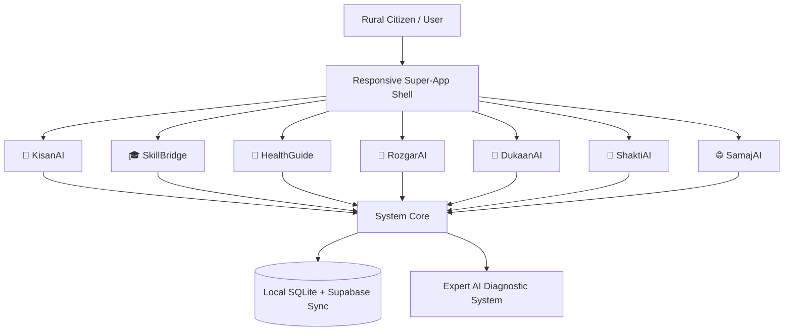

<p align="center">
  <a href="https://github.com/ByteBySway/bharat-ai">
    
  </a>
</p>

<p align="center">
  <strong>AI for every Indian, in every village, for every dream.</strong>
</p>

<p align="center">
  <a href="https://bharat-ai-sway.vercel.app">
    
  </a>
  
  
  
</p>

<p align="center">
  BharatAI is a single, premium web super-app tailored specifically to address the unique challenges faced by rural communities across India. It aggregates <strong>7 distinct modular portals</strong> under one responsive shell, featuring localized database systems, translation layers, offline queue synchronization, accessibility modes, and an Expert AI Diagnostic System.
</p>

---

## 📌 Executive Architecture & Tech Stack



* **Frontend Engine**: Responsive HTML5, Tailwind CSS, Lucide Icon Pack
* **Data Layer**: Supabase REST Sync with local offline-first fallback
* **AI Diagnostic Classifier**: Local Rule-Based Expert Parser & API-integrated Claude 3.5 Sonnet

---

## 🌟 Gamification & Local Impact

BharatAI incentivizes digital literacy and rural participation through gamification:

* **BharatPoints Ledger**: Earn rewards for performing checks (soil verification, quizzes, accounting logs).
* **District Leaderboard**: High-contrast scorecard comparing top villages and blocks (e.g., Tigrana Village vs. Bhiwani Block).
* **Interactive Impact Map**: Clickable state selectors (Haryana, Punjab, Rajasthan, etc.) displaying regional SHG savings and cooperative stats.

---

## 📦 The 7 Portals & Highlight Features

| Portal | Scope & Purpose | Core Features |
| :--- | :--- | :--- |
| **🌱 KisanAI** | Agriculture & Veterinary | AI Crop Doctor, Mandi pricing charts, Cattle symptom analyser, Carbon credits estimator |
| **🎓 SkillBridge** | Education & Digital Literacy | Mentor booking, career roadmaps, NCERT reader, mid-day meal tracker |
| **🏥 HealthGuide** | Rural Healthcare | Symptom severity rating, maternal advisor week-by-week, drug checker |
| **💼 RozgarAI** | Livelihood & Gig Hub | Local job boards (MGNREGA/remote), AI resume builder, mock interview panels |
| **🏪 DukaanAI** | Micro-Finance & Accounting | Digital ledger book (Khaata), GST invoicing, compound interest calculator |
| **👩 ShaktiAI** | Women Empowerment | SHG register, folk art vault, handicraft multiplier, emergency SOS |
| **🌐 SamajAI** | Community & Transit | Gram Panchayat reporter, WhatsApp scam verification, carpool coordination |

---

## 🚀 Installation & Quickstart

### Prerequisite
Make sure Python 3.11+ and Node.js are installed.

### 1. Local Setup
Clone the repository (once pushed) and install dependencies:
```bash
git clone https://github.com/ByteBySway/bharat-ai.git
cd bharat-ai
npm install
```

### 2. Configure Database & Environment
Run the schema setup script:
```bash
# Setup the database schemas
sqlite3 database.db < schema.sql
```

### 3. Run Locally
Start the local node server:
```bash
node server.js
```
Open your browser and navigate to `http://localhost:3000`.

---

## ⚖️ License
This project is licensed under the MIT License - see the [LICENSE](LICENSE) file for details.
